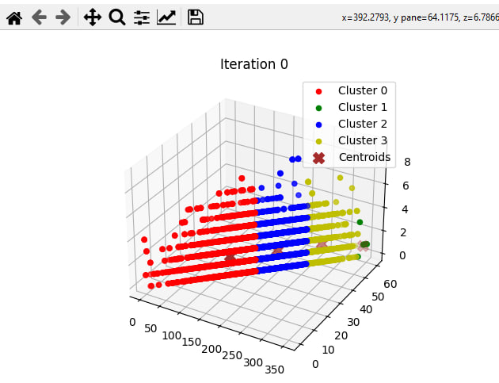
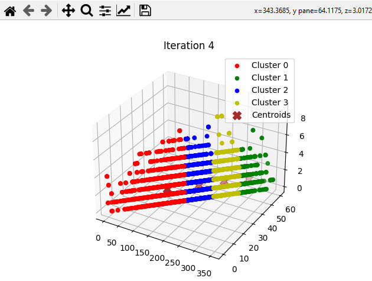

# Telecom Client Segmentation using K-means from scratch
This project was developed as a showcase of how clustering could be used with classification in a real-world scenario.

You can get a prediction for you/your client by entering data such as: 
   1) Number of client's calls to the call-center
   
   2) Phone calls' duration
      
   Et cetera.
   
  Then, click on the 'predict' button at the very bottom of the Graphical User Interface and get your prediction based on the data inputed.
  
Example:

## Cluters' Visualization 
In this section, the first and fifth iterations' visualizations are presented.

   
  First iteration

   
  Fifth iteration

As far as we can see, it took the K-means algorithm 4 iterations to 'optimize' the second cluster (Cluster 1).
